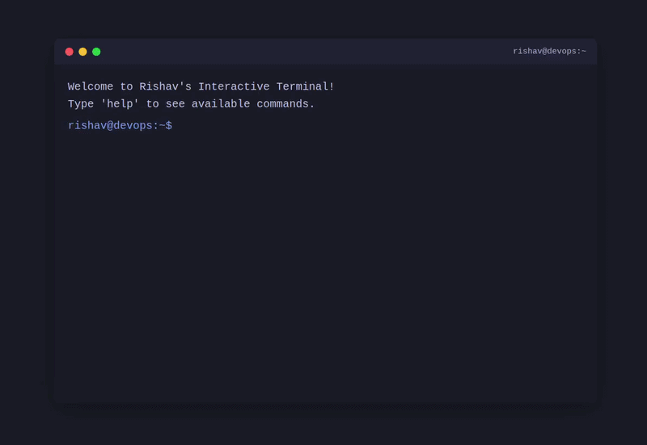

<div align="center">

# Rishav Kumar

## DevOps Engineer • Cloud Infrastructure • Kubernetes • Automation

[](https://www.linkedin.com/in/rishavkumarsah/)
[](https://github.com/rishavkrsah)
[](mailto:rishav.kr.sah@gmail.com)
[](https://github.com/rishavkrsah)
[](https://github.com/rishavkrsah?tab=repositories)

</div>

---

##  About Me

DevOps Engineer focused on building scalable infrastructure, automating deployments, and improving production reliability across cloud-native environments.

I work primarily with **AWS**, **Kubernetes**, **Terraform**, and **CI/CD platforms** while continuously exploring modern DevOps and SRE practices around observability, automation, and infrastructure scalability.

-  Automating infrastructure and deployment workflows
-  Working with cloud-native and containerized platforms
-  Managing Kubernetes workloads and CI/CD pipelines
-  Improving monitoring, alerting, and operational visibility
-  Interested in DevOps, SRE, Platform Engineering & Cloud Security

---

##  Interactive Terminal

**Try my interactive DevOps terminal!**

<div align="center">
  
<a href="https://rishavkrsah.github.io/terminal/" target="_blank">
  
</a>

<br/>
<br/>

<a href="https://rishavkrsah.github.io/terminal/">
  
</a>

<br/>
<br/>

**Available Commands:** `help` • `about` • `skills` • `experience` • `projects` • `contact` • `resume` • `social`

</div>

---

##  Tech Stack

###  Cloud & Infrastructure


###  DevOps & CI/CD


###  Containers & Orchestration


###  Monitoring & Observability


###  Security & DevSecOps


###  Programming & Scripting


###  Version Control & Collaboration


---

##  Core Expertise

```yaml
Cloud Infrastructure:
  platforms: [AWS, Azure, GCP]
  services:
    - EC2, EKS, Lambda, RDS, S3, CloudWatch
    - VPC, Security Groups, Load Balancers
    - IAM, Route53, CloudFront
  
Container Orchestration:
  kubernetes:
    - EKS, AKS, GKE cluster management
    - Helm charts and package management
    - Resource optimization and autoscaling
    - Zero-downtime deployments
  docker:
    - Multi-stage builds
    - Image optimization
    - Registry management

Infrastructure as Code:
  tools: [Terraform, CloudFormation, Ansible]
  practices:
    - Modular and reusable configurations
    - Multi-environment management
    - State management and drift detection
    
CI/CD & Automation:
  platforms: [Jenkins, GitHub Actions, GitLab CI, Azure DevOps]
  practices:
    - End-to-end pipeline design
    - GitFlow branching strategies
    - Automated testing and deployment
    - Rollback strategies
    
DevSecOps:
  security:
    - Secrets management (Vault, AWS Secrets Manager)
    - Code scanning (SonarQube)
    - Vulnerability scanning
    - RBAC and IAM policies
    
Observability:
  stack: [Prometheus, Grafana, ELK, CloudWatch]
  focus:
    - Metrics collection and visualization
    - Log aggregation and analysis
    - Alert configuration
    - SLI/SLO implementation
